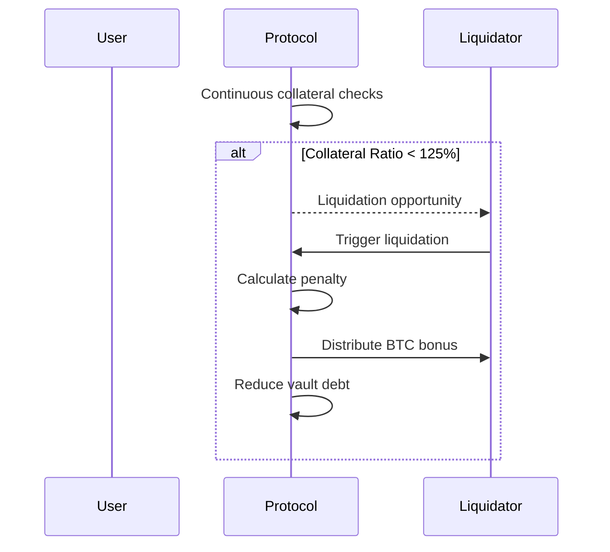

# BitBridge Finance: Bitcoin-Backed Lending Protocol

A decentralized lending protocol enabling Bitcoin holders to access liquidity while maintaining BTC exposure. Built on Stacks for native Bitcoin integration.

## Key Features

- **BTC Collateralization**  
  Secure deposit of Bitcoin as collateral using Stacks blockchain capabilities

- **Dynamic Interest Rates**  
  Algorithmic borrowing rates adjusted through governance

- **Risk-Managed Vaults**  
  Configurable parameters:
  - Minimum Collateral Ratio (150% default)
  - Liquidation Threshold (125% default)
  - Liquidation Penalty (10% default)

- **Transparent Liquidations**  
  Automated process for undercollateralized positions:
  1. Continuous collateral health monitoring
  2. Penalized liquidation system
  3. Incentivized liquidator participation

- **Protocol Governance**  
  DAO-controlled parameters with:
  - Emergency pause functionality
  - Risk parameter adjustments
  - Fee structure management

## System Architecture

### Core Components

1. **Vault Management**
   - `create-vault`: Initialize collateralized position
   - `deposit/withdraw-collateral`: Manage BTC collateral
   - `borrow/repay`: Stablecoin loan operations

2. **Price Oracle**
   - BTC/USD feed with validity checks
   - Time-bound price updates (1hr freshness)
   - Authorized provider system

3. **Interest Engine**
   ```clarity
   (define-private calculate-interest
       (borrowed-amount uint)
       (blocks-passed uint)
     )
     ;; Annualized 5% base rate + compound interest
   ```

4. **Liquidation System**
   - Real-time collateral ratio checks
   - Penalty-distribution mechanism
   - Partial liquidation support

5. **Governance Framework**
   - Parameter control via:
   ```clarity
   (set-minimum-collateral-ratio)
   (set-liquidation-threshold)
   (set-protocol-fee)
   ```

### Contract Structure

| Component          | Description                                  |
|--------------------|----------------------------------------------|
| Vaults Map         | User collateral/loan positions               |
| Protocol Reserves  | Stablecoin liquidity pool                    |
| Governance Tokens  | DAO voting rights management                 |
| Risk Parameters    | Configurable protocol settings               |

## Smart Contract Interactions

### User Flow

1. **Deposit Collateral**
   ```clarity
   (deposit-collateral u100000000) ;; 1 BTC in satoshis
   ```

2. **Borrow Stablecoins**
   ```clarity
   (borrow u50000) ;; $500 in cents
   ```

3. **Monitor Position**
   ```clarity
   (get-vault-health 'user-address) ;; Returns 15000 = 150% ratio
   ```

4. **Repay Loan**
   ```clarity
   (repay u55000) ;; $550 repayment
   ```

### Liquidation Process



## Governance Model

### Control Parameters

| Parameter                  | Default | Range  | Governance Method |
|----------------------------|---------|--------|-------------------|
| Minimum Collateral Ratio   | 150%    | 125-200% | DAO Vote         |
| Liquidation Threshold      | 125%    | 110-150% | Multisig         |
| Protocol Fee Rate          | 1%      | 0-5%     | Token Vote       |
| Interest Rate Model        | 5% APR  | 2-50%    | Algorithmic       |

```clarity
(define-public (set-protocol-fee (new-fee uint))
  ;; Requires DAO approval
```

## Security Features

### Protocol Safeguards

1. **Collateral Verification**
   - Realtime BTC price checks
   - Oracle freshness validation
   ```clarity
   (define-private get-btc-price)
   ```

2. **Financial Constraints**
   - Overflow-protected calculations:
   ```clarity
   (mul-div a b c) ;; a*b/c with safety checks
   ```

3. **Access Control**
   - Owner-restricted functions:
   ```clarity
   (define-private (is-contract-owner))
   ```

4. **Emergency Systems**
   - Protocol-wide pause:
   ```clarity
   (toggle-protocol-pause)
   ```

## Development Setup

### Requirements

- Stacks Node v3.0+
- Clarinet SDK
- Bitcoin testnet access

### Installation

```bash
git clone https://github.com/bitbridge-finance/core
clarinet install
clarinet test
```